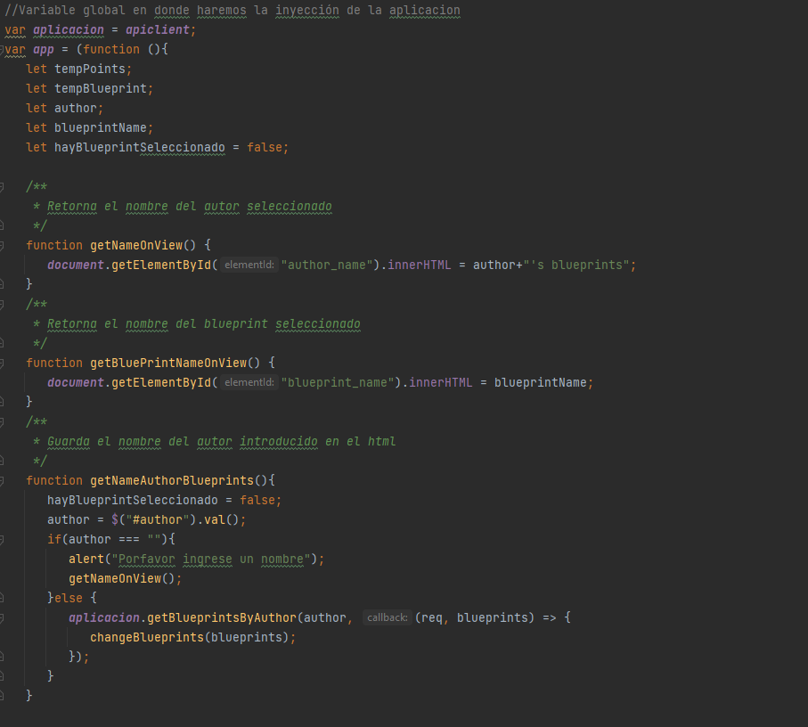
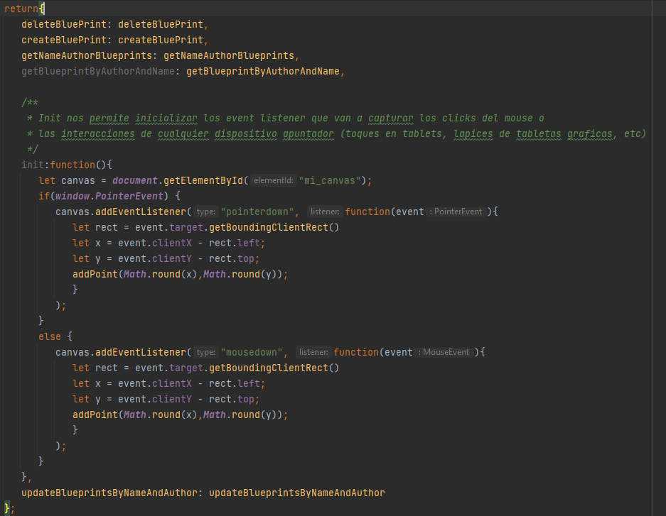
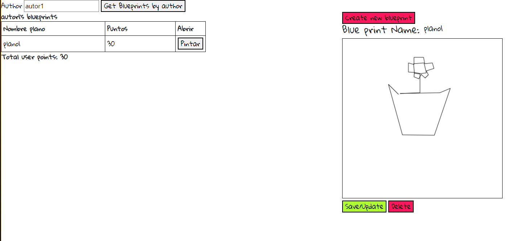
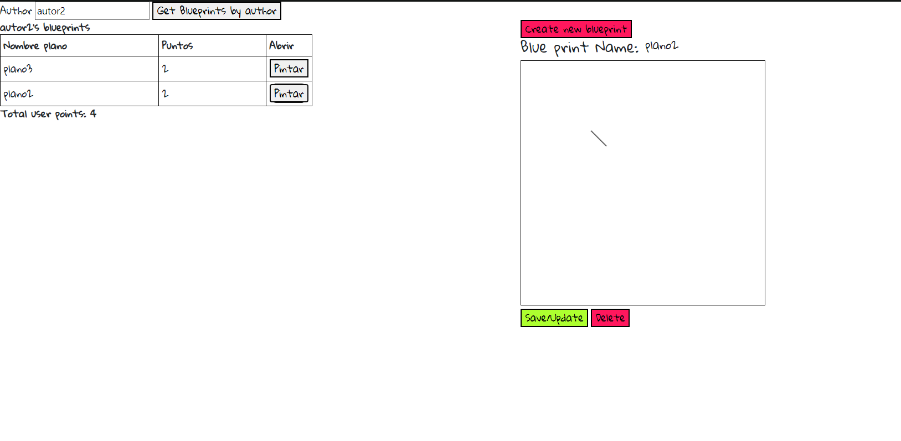
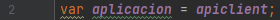

# Lab-6 & 7-ARSW
# Archila - Giraldo
## Rest Client Blueprint

https://github.com/archila-giraldo/Lab-6-ARSW/blob/main/Diagrama%20sin%20t%C3%ADtulo.drawio

---

### Parte 1
+ Siguiendo el patrón modulo estructuramos nuestra app de la siguiente forma  luego como elementos publicos tenemos lo siguiente
 los cuales son los metodos a los cuales podemos acceder desde afuera del scope de la función

+ La consulta de los elementos se puede ver de la siguiente forma

En donde podemos seleccionar uno de los planos para pintarlo por el canvas
En caso de que un autor tenga más de un plano

+ Realizamos la apiclient que es la que nos permite conectar el front con el back
[  src/main/resources/static/js/apiclient.js
](src/main/resources/static/js/apiclient.js)
y en caso de que queramos volver a utilizar el apimock solo debemos cambiar la siguiente linea de codigo de app.js

---
### Parte 2

+ agregamos el manejador de clicks de la siguiente forma

y creamos los metodos de create, delete y update para los blue prints

+ En esta parte solo es necesario crear los metodos en el controller que nos permita realizar las acciones que necesitamos con el blueprint

---
